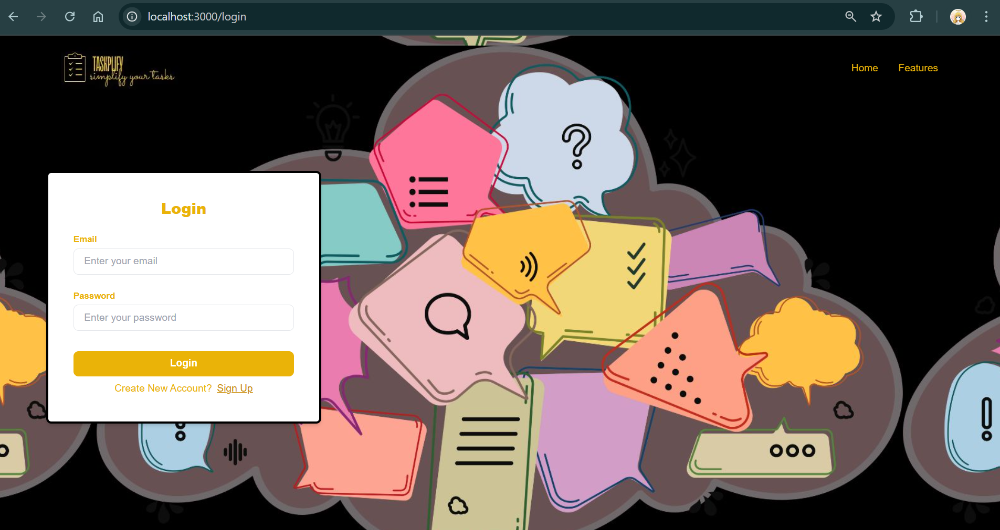

# Tasks Manager Project

Tasks Manager Project is a monorepo for managing tasks consisting of a frontend (built with Next.js) and a backend (built with Express.js and Prisma). It is containerized using Docker and Docker Compose for easy setup and deployment.
Create your task card and start manage your task lists.

## Project Preview

<li>Sign-Up Page</li>
<li>Users can create an account by providing their name, email, and password.</li>

<li>Login Page</li>
<li>Users can log in to their accounts using the same email and password they provided during account creation.</li>

<li>Home Page</li>
<li>Users can create task cards and manage their task lists using drag-and-drop functionality.</li>
<li>Users can edit a task list by double-clicking the edit icon next to it./li>
<li>Users can delete a task list by double-clicking the delete icon next to it./li>
<li>Users can edit a task card by clicking the edit icon next to it.</li>
<li>Users can delete a task card by clicking the delete icon next to it.</li>
<li>Users can create new task cards and task lists.</li>

## Project Structure

tasks-manager/
├── apps/
│ ├── frontend/
│ └── backend/
├── docker-compose.yml
├── package.json
└── README.md

## How to install and Run the Project

<li>git clone "project repository link"</li>
<li>cd tasks-manager</li>
<li>Copy .env.local file to .env on the apps/backend folder. </li>
<li>Open your .env file and change DATABASE_URL and SESSION_SECRET correspond to your configuration.</li>
<li>Go to apps/backend folder and run</li>
### Prisma Set up
<li>pnpm install</li>
<li>pnpm prisma init</li>
<li>pnpm prisma migrate deploy</li>
<li>pnpm prisma generate</li>
<li>pnpm dev</li>
<ol>
<li>Go to apps/frontend folder and run</li>
<ol>
<li>pnpm install</li>
<li>pnpm dev</li>
<ol>

## Accessing the project

<li>Frontend: http://localhost:3000</li>
<li>Backend: http://localhost:4000</li>
